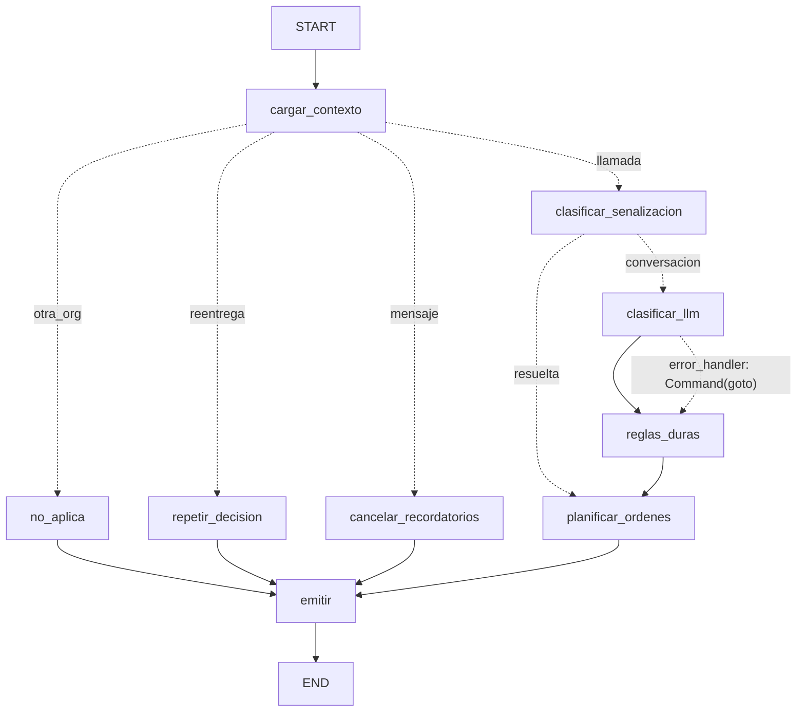

# Orquestador post-llamada (reto Kontaktu · Python + LangGraph)

Recibe **un evento** (`call.ended` o `message.received`), clasifica cómo fue la llamada y emite una decisión y
las órdenes que procedan contra el CRM. Cada ejecución es un proceso nuevo; lo que hay que recordar entre eventos
(intentos, recordatorios, bajas, cortadas, claves ya emitidas) se guarda en `salida/estado.sqlite`.

## Cómo se ejecuta

```bash
uv sync                                          # o: pip install -r requirements.txt  (Python ≥ 3.12)
cp .env.example .env                             # OPENAI_API_KEY=...  ·  MODELO= (vacío → gpt-6-luna)
python run.py eventos/01-call-ended-nuria.json   # con uv: uv run python run.py ...
uv run python scripts/ejecutar_lote.py           # el lote entero desde cero, un proceso por evento, y validación
```

Salida: líneas añadidas a `salida/decisiones.jsonl` y `salida/ordenes.jsonl`. Código 0 si se procesó el evento,
1 si hubo un error interno (queda una decisión `otro` de respaldo) y 2 si la entrada es ilegible.
**Para empezar de cero, se borra `salida/`**, que contiene también el estado.

## Cómo funciona



- **Determinista primero.** SIP y AMD resuelven ocupado, rechazada, sin respuesta, buzón y `otro` técnico sin LLM
  (`senalizacion.py`). La cita creada da `visita_reservada`.
- **El LLM solo lee conversaciones** (`clasificador_openai.py`, prompts en `prompts/`). Lo hace con salida
  estructurada `json_schema` strict, limitada a las etiquetas conversacionales. Extrae además la hora del callback,
  si pide la baja, si rechaza WhatsApp, la nota de contexto y el email.
- **Las reglas duras mandan sobre el modelo** (`reglas.py`). La baja gana a todo; la detecta el LLM, con una regex
  acotada **solo si el LLM no responde**, para que N2 se cumpla aunque OpenAI caiga. Si no hay salida del LLM, la
  etiqueta es `otro` y se crea la tarea de revisión.
- **La política es una tabla en código** (`politica.py`): etiqueta → órdenes, y luego los filtros N3, N1, N4 y N2.
  Las fechas se calculan en `calendario.py` con zoneinfo Europe/Madrid, con la ventana inclusiva y teniendo en
  cuenta días hábiles y el cambio de hora.
- **Una transacción por evento** (`salida.py`, `persistencia.py`). Cada orden se valida contra el OpenAPI y la
  decisión contra su esquema. Las claves ya emitidas se omiten (R5). El estado y los JSONL se escriben juntos o no
  se escribe nada (R8).
- **El modelo es `gpt-6-luna` con `reasoning_effort=none`.** Es una tarea corta de clasificación y extracción en
  español; con llamadas reales acertó 16/16 y 21/21 en unos 2,5 s por llamada. Con razonamiento daba la misma
  respuesta con el doble de latencia. Se cambia con `MODELO` (y `RAZONAMIENTO`).

Las decisiones de diseño y cada interpretación de la especificación, con su porqué, están en
[`docs/decisiones.md`](docs/decisiones.md). La spec aprobada antes de programar está en `docs/superpowers/specs/`.

## Qué dejé fuera y por qué

- **Festivos:** `campana.yaml` no los declara; los días hábiles son de lunes a viernes.
- **Atomicidad entre JSONL y SQLite:** las líneas se escriben dentro de la transacción y antes del COMMIT. Si el
  proceso muriera justo entre las dos cosas, quedarían líneas sin estado. Es una ventana mínima; cerrarla del todo
  requeriría que el estado fuera la única fuente de verdad y regenerar los JSONL a partir de él.
- **Concurrencia:** los eventos llegan de uno en uno. `BEGIN IMMEDIATE` serializa aun así si dos procesos coincidieran.
- **Reintentos de errores no transitorios** (400, salida imparseable): no mejoran reintentando y van directos a `otro`.
- **Trazas (LangSmith) y métricas:** sin red salvo el modelo.

## Cómo verifiqué que hace lo que creo

1. **Tabla dorada.** La salida esperada de los 16 eventos (16 decisiones y 29 órdenes con sus fechas) la calcularon
   por separado la IA principal y un agente revisor, y coincidió. `tests/test_lote_ejemplo.py` la comprueba con un
   clasificador doble y reproduce el ejemplo resuelto **byte a byte, con los mismos `orden_id`**.
2. **21 eventos extra** (`tests/eventos_extra/`, generados a partir de eventos reales): los casos sin ejemplo, los
   pares que se parecen y las reglas con estado (N1–N4, baja con recordatorios, sábado y domingo).
3. **Unitarias:** ventana inclusiva, sábado y domingo, días hábiles, cambio de hora, señalización y regex de baja.
   **Robustez:** salida imparseable del LLM, caída de red con 3 reintentos, JSON roto, campos ausentes, `run.py`
   como proceso, y la baja detectada aunque el LLM falle.
4. **LLM real con `scripts/ejecutar_lote.py`**, desde cero y un proceso por evento: lote de ejemplo 16/16 y extra
   21/21, con 0 errores de esquema.
5. **Revisión de buenas prácticas** con un agente que contrastó el código con la documentación oficial (MCP
   `docs-langchain`) y con el código fuente instalado. Encontró 6 riesgos de robustez; están corregidos y cada uno
   tiene su test (detalle en `docs/decisiones.md`).
6. **Revisión final de bugs** con otro agente que no escribió el código. Encontró 8 fallos de comportamiento, entre ellos uno crítico: la regex de baja daba falsos positivos y pisaba al LLM. Cada fallo tiene un test de regresión (`tests/test_revision_final.py`). Comprobé que esos tests **fallan con el código anterior** (14 de 23) y pasan con el nuevo. Después repetí los dos lotes reales: 16/16 y 21/21.

`uv run pytest` ejecuta las pruebas sin red. El proceso con la IA (qué le pedí, qué verifiqué y dónde se equivocó)
está en [`PROCESS.md`](PROCESS.md).
